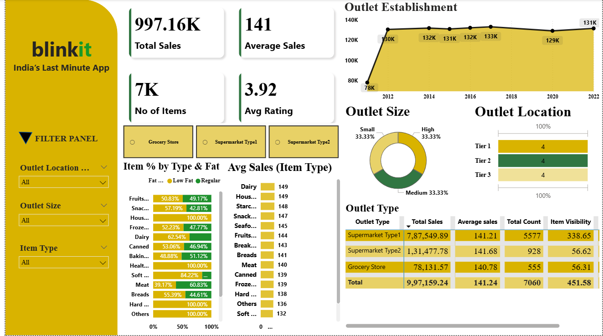

# 📊 Blinkit Sales Dashboard (Power BI)

## Overview
This repository contains a **Power BI dashboard** designed to analyze and visualize sales performance for **Blinkit**.  
The dashboard provides actionable insights into sales trends, product categories, and overall business performance.

---
## 🖼️ Dashboard Preview

---

## ✨ Features
- **Sales Overview**: Track total sales, orders, and growth trends  
- **Category Analysis**: Identify top-performing product categories  
- **Customer Insights**: Understand purchasing behavior  
- **Interactive Filters**: Filter by category and location  

---

## 🛠️ Tools & Technologies
- Power BI  
- Power Query  
- DAX  

---

## 📂 Repository Structure
- `data/` → Sample datasets used for dashboard creation  
- `pbix/` → Power BI project files (`Blinkit_Sales.pbix`)  
- `images/` → Dashboard screenshots for README and documentation  
- `README.md` → Project documentation  

---

## 🚀 Key Insights
- Identified top-performing product categories driving revenue  
- Analyzed outlet-level performance trends  
- Enabled data-driven decision-making through interactive visuals  

---

## 📌 How to Use
1. Download the `.pbix` file from the `pbix/` folder  
2. Open in Power BI Desktop  
3. Interact with filters and visuals to explore insights  
